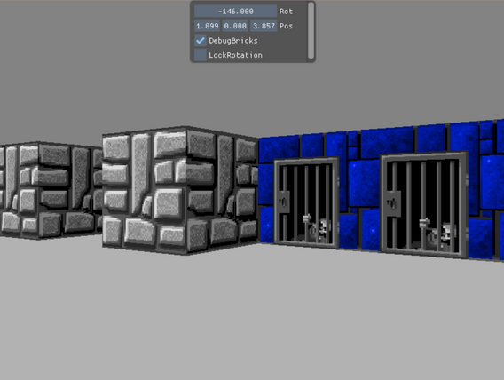

# Exercise 6

## Setup
- Move te exercise folder folder inside SimpleRenderEngineProject
- Add submission folder as subdirectory at the end of `SimpleRenderEngineProject/CMakeLists.txt`
```
# ...

### misc
mark_as_advanced(
	SDL2MAIN_LIBRARY
)


# add this here
add_subdirectory(GameProgramming24/Exercise4)
```



## 6.1
Implement the camera movement
- the camera should rotate with A/D or with the mouse movement left and light
- the camera should move forward and backward with W/S, keeping in mind the camera rotation

If you are using the provided code, you will need to complete `ComponentController::Update()` and `ComponentController::KeyEvent()`.
There is also a UI component that will show you the camera position and rotation, which you can change at runtime to test stuff.

## 6.2
Create a procedural cube
- create a face of size 1, centered around the origin, looking at the camera
- assign UV coordinates to the vertices to show one of the wall tiles in `data/level0.png`
- create 3 additional faces to generate a cube without top or bottom

If you are using the provided code, you will need to complete `ComponentRendererMesh::Init()`.

## 6.3
Level layout
- create a new component for handling the level layout. The component should have the following serialized data
	- an array of array of integers `layout` (-1 should represent empty space, 0 the first tile in the `data/level0.png`, 1 the second, and so on)
	```
	# example layout format, you may want something a bit bigger to test your generation, with different tiles
	[
		[1,  1, 1],
		[1, -1, 1],
		[1,  1, 1]
	]
	```
	- (optional) a size
- on init, the component should
	- create a new gameObject with a `ComponentRenderMesh` for each entry in `layout`
	- assign different UV coordinates to the cube, so that each face shows the appropriate tile in the texture
	- set the position of the child gameObjects to replicate the structure in 3D space

## Additional challenges
- NPCs: additional entities that randomly move in the empty spaces of your level. You may want to think about
	- rendering: small cubes floating around? Quads always looking at the camera?
	- movement: how to avoid walls (tip: you don't really need collisions for this ;))? Move randomly, or chase the player?
- architecture: a lot of things are hardcoded in the exercise to make it as clear and easy to read as possible. How would you restructure it? What is worth moving to the json?
- data serialization format: the way we serialize the level layout (array of array of integer) is not very efficient, especially for big, mostly empty levels. How could we improve on that?