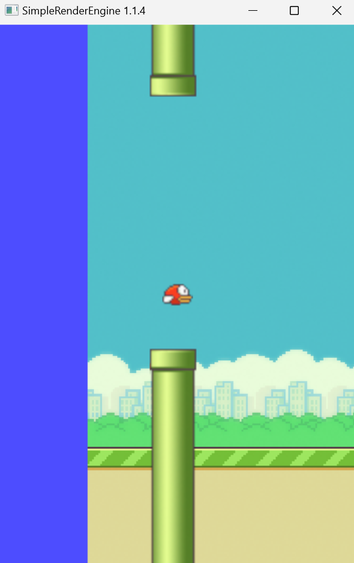

# Exercise 8


## Setup
- Move te exercise folder folder inside SimpleRenderEngineProject
- Add exercise folder as subdirectory at the end of `SimpleRenderEngineProject/CMakeLists.txt`
```
# ...

### misc
mark_as_advanced(
	SDL2MAIN_LIBRARY
)


# add this here
add_subdirectory(GameProgramming24/Exercise8)
```



# 8.1 Controlling the bird
See `ComponentController` in the game section of the project
- Apply an appropriate constant linear velocity to the bird,
  to make it move to the right at constant speed
  (check `ComponentPhysicsBody`, already added to the game object)
- On spacebar press, apply an appropriate upwards inpulse

# 8.2 Create wall colliders
See `ComponentSpawner` in the game section of the project
- Create a collider for the floor
- The walls should not move or rotate on space, only the bird
  (keep in mind that the camera is locked on the bird, so it will look like the opposite, but it's normal)
- (optional) End the game when the bird collides with a wall or floor
To show a debug draw of the physic bodies, press F2

# 8.3 Spawn pickups
See `ComponentSpawner` in the game section of the project
- Spawn coins (following a similar appropach to the walls)
- The coins should not overlap walls
- When the bird collides with a coin, the latter should disappear
- The bird velocity and position should not be affected by the coins in any way
You can create a new `ComponentPickup` to handle the despawning, or you can trigger it from the general controller
